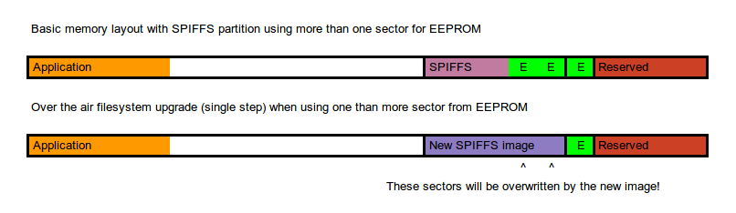
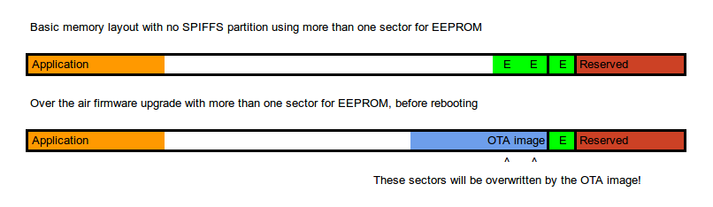

# EEPROM Rotate

This is a wrapper around the Arduino Core for ESP8266 EEPROM library that handles sector rotating while keeping full compatibility with the original API.

If you are using the ESP32, visit the repository for the ESP8266 version of this library here: https://github.com/xoseperez/eeprom32_rotate

Read my post about these libraries here: http://tinkerman.cat/eeprom-rotation-for-esp8266-and-esp32/

[](CHANGELOG.md)
[](https://travis-ci.org/xoseperez/eeprom_rotate)
[](https://www.codacy.com/app/xoseperez/eeprom_rotate/dashboard)
[](LICENSE)
<br />
[](https://www.paypal.com/cgi-bin/webscr?cmd=_donations&business=xose%2eperez%40gmail%2ecom&lc=US&no_note=0&currency_code=EUR&bn=PP%2dDonationsBF%3abtn_donate_LG%2egif%3aNonHostedGuest)
[](https://twitter.com/intent/follow?screen_name=xoseperez)

The emulated EEPROM in the ESP8266 uses one SPI flash memory sector to store the data. Due to the nature of this flash memory (NOR) a full sector erase must be done prior to write any new data. If a power failure (intended or not) happens during this process the sector data is lost.

Also, writing data to a NOR memory can be done byte by byte but only to change a 1 to a 0. The only way to turn 0s to 1s is to perform a sector erase which turns all memory positions in that sector to 1. But sector erasing must be done in full sectors, thus wearing out the flash memory faster.

A way to overcome this is to use more than one sector to store data and check on boot which one is has the latest valid data.

This is what this library does.

## How does it work?

Instead of using a single sector to persist the data from the emulated EEPROM, this library uses a number of sectors to do so: a sector pool.

The library overwrites two methods of the original one: `begin` and `commit`.

The `begin` method will load the data from all the sectors in the sector pool one after the other trying to figure out which one has the **latest valid information**. To do
this it checks two values:

* A 2-bytes CRC
* A 1-byte auto-increment number

These values are stored in a certain position in the sector (at the very beginning by default but the user can choose another position with the `offset` method).

The CRC is calculated based on the contents of the sector (except for those special 3 bytes). If the calculated CRC matches that stored in the sector then the library checks the auto-increment and selects the sector with the most recent number (taking overflows into account, of course).

Those special values are stored by the overwritten `commit` method prior to the actual commit.

With every commit, the library will hop to the next sector. This way, in case of a power failure in the middle of a commit, the CRC for that sector will fail and the library will use the data in the latest known-good sector.

## API

The library inherits form the Arduino Core for ESP8266 EEPROM library, and it shares the same API. You can just replace one with the other. The same public methods with the same signature. By default it will use the same sector as with the EEPROM library (sector 1019 for 4Mb boards, sector 251 for 1Mb boards), or you can specify another sector in the constructor. It can behave like a drop-in replacement.

If you define a sector pool size different that one (using the `size` method). The other sectors are the ones counting from the base one downwards. This means that if we set up a sector pool size of 4 for a 4Mb board using default base sector, the used sectors will be 1019, 1018, 1017 and 1016.

The library exposes a set of new methods to configure the sector rotating and performing other special actions:

#### bool backup(uint32_t sector) | bool backup()

Backups the current data to the given sector. If no sector is specified the base sector will be used. See also the `rotate` method.

#### uint8_t base()

Returns the base sector. Note that sectors in use are those N sectors before the base sector, including the base sector. If base sector is 1019 and sector pool size is 4, these sectors will be 1019, 1018, 1017 and 1016.

#### uint8_t current()

Returns the sector index whose contents match those of the EEPROM memory buffer.

#### void dump(Stream & debug, uint32_t sector) | void dump(Stream & debug)

Dumps the EEPROM data to the given stream in a human-friendly way. If no sector is specified it will dump the data for the current sector.

#### uint8_t last()

Returns the number of the last available sector for EEPROM. This is also the sector that the default EEPROM library uses. You can use this value to choose a sensible pool size:

```
uint8_t size = 0;
if (EEPROM.last() > 1000) { // 4Mb boards
    size = 4;
} else if (EEPROM.last() > 250) { // 1Mb boards
    size = 2;
} else {
    size = 1;
}
EEPROM.size(size);
EEPROM.begin();
```

#### void offset(uint8_t offset)

Define the offset in the sector where the special auto-increment and CRC values will be stored. The default value is 0. This special data uses 3 bytes of space in the emulated EEPROM memory buffer.

#### bool rotate(uint32_t value)

Enables or disables sector rotation (it is enabled by default). If disabled, it will always write to the last sector. This is useful if you are doing something that might use the other sectors (like an OTA upgrade) and you don't want the library to mess with them. Disabling rotation also sets the `_dirty` flag to True, so it forces next commit to persist the data to the last sector.

It is recommended to backup the data to the last sector before doing an OTA upgrade and disable sector rotation to prevent any EEPROM call to overwrite the OTA image. The suggested way to do it is to call this code in the OTA start callback:

```
EEPROM.rotate(false);
EEPROM.commit();
```

In case the upgrade fails, you might want to reenable sector rotation by calling:

```
EEPROM.rotate(true);
```

See the OTA example for this library.

#### void size(uint8_t size)

Set the sector pool size the library will use. The default value is 1. The valid range is from 1 to 10. It must be called before the `begin` method.

#### uint8_t size()

Returns the number of sectors used to rotate EEPROM.

## Advanced

### Disabling the original global EEPROM object

The original EEPROM library automatically instantiates an EEPROM object that's
already available to use. This consumes little memory (since the data buffer is
only created and populated when calling `begin`). But anyway if you don't want to
have a unused object around you can disable the object instantiation by using
the `NO_GLOBAL_EEPROM` build flag.

## Auto discover EEPROM size

If you are using a custom memory layout the library will automatically discover the number of available sectors for EEPROM. These will be the number of sectors after the SPIFFS memory space except for the last 4 (reserved by Espressif).

This is the original memory layout configuration for a 1Mb flash size board with no SPIFFS space (eagle.flash.1m0.ld):

```
/* Flash Split for 1M chips */
/* sketch 999KB */
/* eeprom 20KB */

MEMORY
{
  dport0_0_seg :                        org = 0x3FF00000, len = 0x10
  dram0_0_seg :                         org = 0x3FFE8000, len = 0x14000
  iram1_0_seg :                         org = 0x40100000, len = 0x8000
  irom0_0_seg :                         org = 0x40201010, len = 0xf9ff0
}

PROVIDE ( _SPIFFS_start = 0x402FB000 );
PROVIDE ( _SPIFFS_end = 0x402FB000 );
PROVIDE ( _SPIFFS_page = 0x0 );
PROVIDE ( _SPIFFS_block = 0x0 );

INCLUDE "../ld/eagle.app.v6.common.ld"
```

Flash memory is mapped at 0x40200000, so a 1Mb flash memory ends at 0x40300000. Here you can see the end of the SPIFFS block is at 0x402FB000. So there are 20480 bytes after that point. Every sector has 4096 bytes so thats 5 sectors. Given that the last for are reserved there is one left for EEPROM.

Now let's see this custom layout:

```
/* Flash Split for 4M chips */
/* sketch 1019KB */
/* spiffs 3040KB */
/* eeprom 16KB */
/* reserved 16KB */

MEMORY
{
  dport0_0_seg :                        org = 0x3FF00000, len = 0x10
  dram0_0_seg :                         org = 0x3FFE8000, len = 0x14000
  iram1_0_seg :                         org = 0x40100000, len = 0x8000
  irom0_0_seg :                         org = 0x40201010, len = 0xfeff0
}

PROVIDE ( _SPIFFS_start = 0x40300000 );
PROVIDE ( _SPIFFS_end = 0x405F8000 );
PROVIDE ( _SPIFFS_page = 0x100 );
PROVIDE ( _SPIFFS_block = 0x2000 );

INCLUDE "eagle.app.v6.common.ld"
```

Now this is a 4Mb board (like the in the ESP12 modules). Flash memory ends at (0x40200000 + 4*1024*1024) 0x40600000. Therefore, after the SPIFFS block there are still 32768 bytes or 8 sectors. 4 of them are reserved, so 4 more are available to rotate the EEPROM contents.

Check the info example in the examples folder.

### OTA (and non-OTA) upgrades

You can use custom memory layouts to "reserve" memory sectors for EEPROM rotating like in the section before. But there is no need for it as long as you take some precautions. Basically, if are using more than one sector and you have not reserved them, all of them but the last will be overwritten when doing an OTA upgrade, because OTA images are first stored at the end of the firmware block. What can you do?

Imagine these scenarios for a 3 sector pool size, with and without SPIFFS block:





The library has the option to disable rotation and force persisting data to the latest sector, the one that's safe from OTA.

So, whenever you do an OTA upgrade (being it firmware or the SPIFFS image) call  `rotate(false)` method first and then `commit()` to force saving the data. The ArduinoOTA library has a `onStart` callback you can use to backup the contents. Same for the Update class. See the `rotate` method above or the OTA example to know more. In case the OTA fails, you might want to reenable rotation calling `rotate(true)` in the `onError` callback.

There is still one special case that could be a problem: non-OTA upgrades. In a wired upgrade the firmware has no control of the situation and it cannot backup the EEPROM before the upgrade. If your image is large enough it may overwrite the sectors in use for the EEPROM pool. For a firmware image this is very unlikely, only with old 512Kb memory chips you may run into problems when flashing big images.

But when flashing the file system you will always hit this problem, because it always overwrites the full SPIFFS block. So if you flashing the SPIFFS block and want to keep the EEPROM configuration you have two options: a custom memory layout that really reserves more sectors for EEPROM or upgrade it always over the air and program your firmware so it first backs up the EEPROM contents to the latest sector using `rotate(false)` and `commit()`.

Doing `rotate(false)` and `commit()` has a benefit over `backup()` that it will prevent any other EEPROM write to overwrite the OTA image, preventing corruption.

## License

Copyright (C) 2018 by Xose Pérez <xose dot perez at gmail dot com>

The EEPROM_Rotate library is free software: you can redistribute it and/or modify
it under the terms of the GNU Lesser General Public License as published by
the Free Software Foundation, either version 3 of the License, or
(at your option) any later version.

The EEPROM_Rotate library is distributed in the hope that it will be useful,
but WITHOUT ANY WARRANTY; without even the implied warranty of
MERCHANTABILITY or FITNESS FOR A PARTICULAR PURPOSE.  See the
GNU Lesser General Public License for more details.

You should have received a copy of the GNU Lesser General Public License
along with the EEPROM_Rotate library.  If not, see <http://www.gnu.org/licenses/>.
